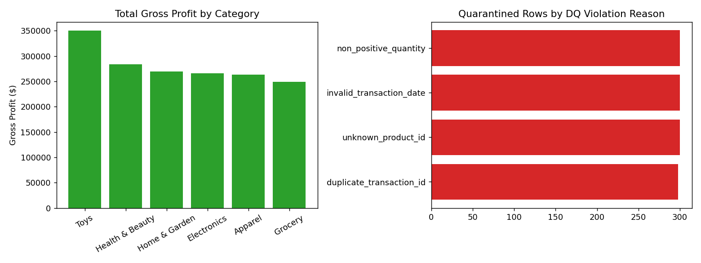

# 🏬 Retail ETL & Data Warehouse Platform

**A production-style ETL pipeline: messy raw retail exports → validated, auditable data quality gate → star-schema data warehouse → dbt-style SQL marts → a read-only analytics API.**

[](https://github.com/muhammadfarooqshafi/retail-etl-warehouse/actions/workflows/ci.yml)


> Replace the CI badge URL with your own repo path once pushed — it will report real build status automatically.

---

## 🎯 The Business Problem

Every retail or e-commerce analytics team hits the same wall: raw
transactional exports from POS/e-commerce systems are **messy** —
duplicate transaction IDs, malformed dates, orphaned foreign keys, negative
quantities — and unusable for BI until someone manually cleans them, usually
by hand, every single reporting cycle.

**Who faces this:** any retailer, e-commerce company, or franchise
operation running BI/analytics on top of POS or order-management exports.

**Current industry approaches:**
- Manual spreadsheet cleanup before every report — slow, error-prone, not
  version-controlled, and impossible to audit after the fact.
- Silently dropping "bad" rows in an ad-hoc script — no record of *what*
  was excluded or *why*, which becomes a real problem the first time
  finance asks "why doesn't this number reconcile?"
- Building transformations directly in BI tool query editors — untested,
  unversioned, and invisible to the rest of the engineering org.

**Why this solution is better:**
- A **real, auditable data-quality gate**: bad rows are quarantined (not
  dropped) into their own table with the specific violation reason(s)
  attached, so any excluded row can be explained months later.
- A proper **star-schema warehouse** (dimensions + fact table) instead of
  ad-hoc flat tables, so new mart models are cheap to add.
- **dbt-style SQL transformation models** — version-controlled, one file
  per model, directly portable to a real dbt project later.
- **Idempotent** — re-running the pipeline never duplicates data.
- Ships as a real service (FastAPI analytics API + Docker + Kubernetes
  CronJob/Deployment + CI/CD), not a one-off notebook.

---

## 📊 Data Provenance — Important Note

Built in an **offline sandbox with no internet/API access**, so a live POS
export could not be downloaded. `src/extract/generate_source_data.py`
**programmatically generates** a realistic multi-table retail dataset
(stores, products, transactions) — including **intentionally injected data
quality defects** (duplicate IDs, malformed dates, negative quantities,
orphaned foreign keys) at a controlled ~3% rate, so the validation layer has
real, representative messiness to catch, exactly as it would against a real
source system. To point this at a real source, replace the three
`extract_*` functions in `src/extract/readers.py` with real
`pd.read_sql(...)` / API calls — nothing downstream needs to change.

**Scale**: 50,000 transactions · 25 stores · 400 products · 546 distinct
sale dates.

---

## 🏗️ Architecture

Full diagrams (pipeline flow, star schema ERD, data-quality gate) are in
[`docs/ARCHITECTURE.md`](docs/ARCHITECTURE.md). Summary:

```
extract (raw CSVs) → validate (quarantine bad rows) → load (staging tables)
→ transform (dim_store, dim_product, dim_date, fact_sales)
→ mart models (sql/marts/*.sql) → SQLite warehouse → FastAPI analytics API
```

---

## 📁 Project Structure

```
retail-etl-warehouse/
├── src/
│   ├── extract/generate_source_data.py   # synthetic source data (documented)
│   ├── extract/readers.py                # extraction layer
│   ├── quality/validators.py             # data quality gate + quarantine
│   ├── load/warehouse.py                 # schema init, staging load, star-schema build
│   ├── api/main.py                       # FastAPI analytics API
│   ├── pipeline.py                       # end-to-end orchestrator
│   └── utils/config.py, logger.py
├── sql/
│   ├── schema/                           # staging + mart table DDL
│   └── marts/                            # dbt-style SQL transformation models
├── tests/                                # unit + integration tests (14 tests)
├── pipelines/retail_etl_dag.py           # optional Airflow scheduled DAG
├── deployment/kubernetes/                # CronJob (ETL) + Deployment (API) + HPA
├── docker/Dockerfile, docker-compose.yml
├── .github/workflows/ci.yml
├── docs/                                 # architecture, API, deployment guides
├── notebooks/01_warehouse_exploration.ipynb
├── artifacts/                            # data quality report + figures
├── Makefile, requirements.txt, pyproject.toml
```

---

## 📈 Pipeline Results (real output from this repo)

**Data quality gate** — run against 50,000 raw transaction rows:

| Metric | Value |
|---|---|
| Total rows | 50,000 |
| Clean rows loaded | 48,804 |
| Quarantined rows | 1,196 (2.39%) |
| Duplicate `transaction_id` | 298 |
| Invalid `transaction_date` | 300 |
| Non-positive `quantity` | 300 |
| Orphaned `product_id` | 300 |

Every quarantined row is preserved in `stg_quarantined_transactions` with
its exact violation reason(s) — nothing is silently discarded.

**Resulting warehouse:**

| Table | Rows |
|---|---|
| `fact_sales` | 48,804 |
| `dim_date` | 546 |
| `mart_daily_sales_by_store` | 13,276 |
| `mart_monthly_sales_by_category` | 108 |
| `mart_customer_summary` | 7,976 registered customers |

**Business numbers:** $4,105,599.08 total net revenue · $1,682,176.27 total
gross profit across the synthetic dataset.



Full data quality report: [`artifacts/reports/data_quality_report.json`](artifacts/reports/data_quality_report.json)

---

## 🚀 Quickstart

```bash
git clone <YOUR_GITHUB_URL>
cd retail-etl-warehouse

python -m venv .venv && source .venv/bin/activate
pip install -r requirements.txt

make pipeline    # extract -> validate -> load -> transform -> mart models
make test        # run the test suite (14 tests)
make serve       # analytics API at http://localhost:8001/docs
```

### Docker

```bash
docker compose --profile etl run --rm etl   # one-off pipeline run
docker compose up -d api                    # serve on :8001
curl http://localhost:8001/health
```

Full deployment instructions (Kubernetes CronJob + Deployment, cloud
options, CI/CD): [`docs/DEPLOYMENT.md`](docs/DEPLOYMENT.md)

---

## 🔌 API

Auto-generated interactive docs at `/docs`. Full reference:
[`docs/API.md`](docs/API.md)

```bash
curl "http://localhost:8001/sales/daily?store_id=ST-0001&limit=7"
curl "http://localhost:8001/customers/top/by-revenue?limit=5"
```

---

## ✅ What Was Actually Verified in This Repo (Transparency Section)

Built in a sandboxed environment with **no internet access** — exactly what
that means for verification:

| Component | Status |
|---|---|
| Synthetic source data generation (with injected defects) | ✅ Executed — 50,000 transactions generated |
| Data quality validation + quarantine | ✅ Executed — real 2.39% quarantine rate, verified reasons |
| Staging load, star-schema build, mart SQL models | ✅ Executed end-to-end against a real SQLite file |
| Idempotent re-run (no duplicate rows) | ✅ Verified by running the pipeline twice and comparing row counts |
| Unit + integration test suite (14 tests) | ✅ Executed — all passing |
| FastAPI analytics service code | ⚠️ Written and syntax-checked (`python -m py_compile`); **not executed** — `fastapi`/`uvicorn` couldn't be installed in this offline sandbox. Run `make serve` locally to verify. |
| Docker build | ⚠️ Dockerfile written and reviewed; not built here (no Docker daemon/network in sandbox) |
| GitHub Actions CI | ⚠️ Workflow written; only validated once pushed to a real GitHub repo |
| Kubernetes manifests (CronJob, Deployment, HPA) | ⚠️ Written and schema-reviewed; not applied to a live cluster |
| Airflow DAG | ⚠️ Written and syntax-checked; requires an Airflow install to run |

If anything in the "⚠️" rows behaves differently once you run it for real,
please open an issue.

---

## 🗺️ Future Work

- Swap SQLite for Postgres/BigQuery/Snowflake for real production scale
  (the SQL in `sql/marts/` is standard ANSI SQL and needs little rewriting).
- Add a real dbt project wrapping `sql/` once running against Postgres.
- Add Great Expectations-style declarative data quality rules alongside the
  custom validators.
- Add a Streamlit dashboard on top of the analytics API for non-technical
  stakeholders.
- Add streaming ingestion (Kafka) for near-real-time transaction loading
  instead of daily batch.

---

## 📄 License

MIT — see [LICENSE](LICENSE).

## 📬 Contact

**Muhammad Farooq Shafi**
📧 mfarooqsgafee333@gmail.com
💼 [LinkedIn](https://www.linkedin.com/in/muhammadfarooqshafi/)
🐙 GitHub: `<YOUR_GITHUB_URL>`
📘 [Facebook](https://www.facebook.com/profile.php?id=61575167257313)
