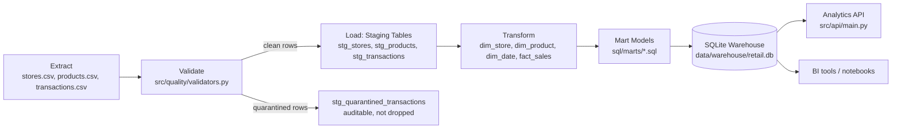
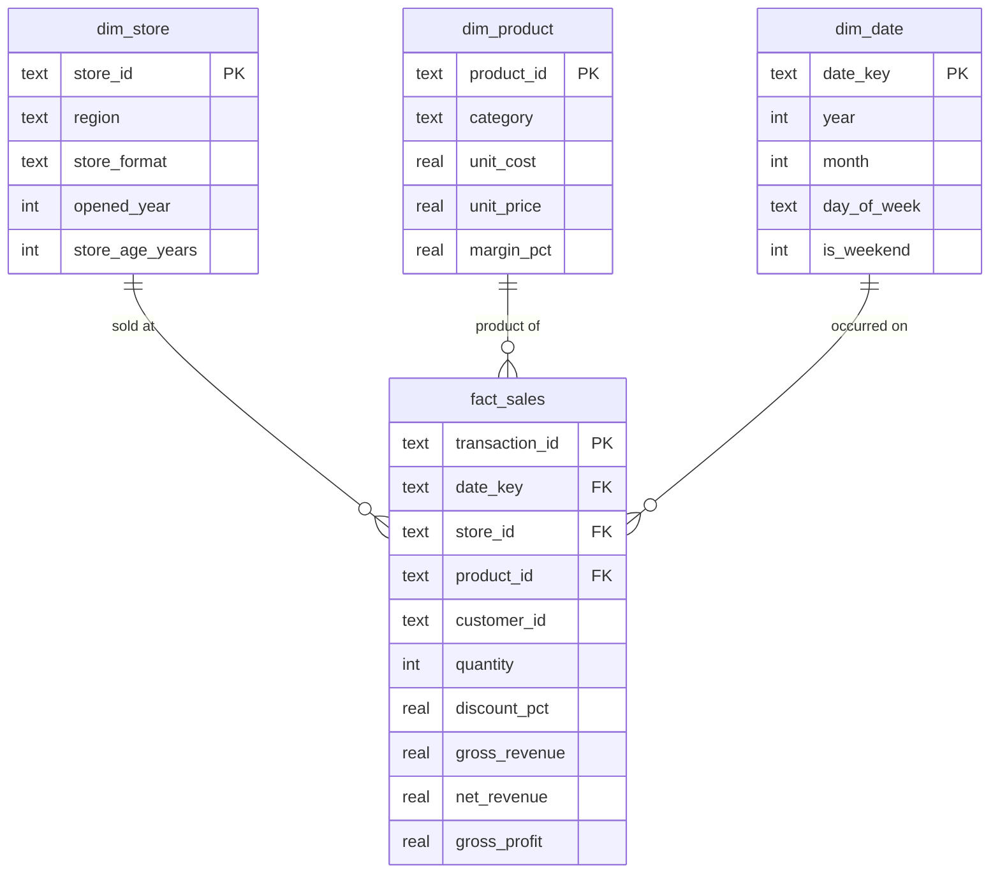
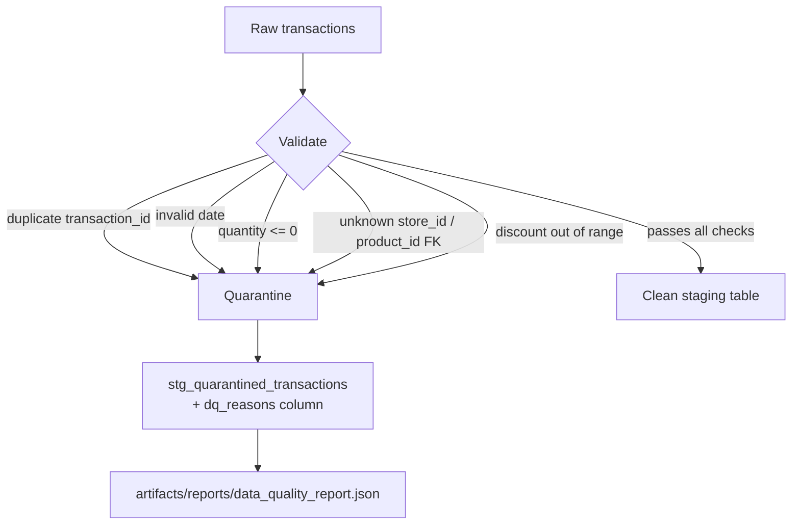

# Architecture

## Pipeline overview

## Star schema

## Data quality gate

Rows are **quarantined, not silently dropped** — every excluded row remains
queryable with its specific violation reason(s), which is what a real
incident review ("why is store ST-0007's revenue lower than expected this
week?") actually requires.

## Why this stack

| Layer | Choice | Why |
|---|---|---|
| Warehouse | SQLite | Zero setup, fully portable, and the schema/SQL is standard enough to port directly to Postgres/Snowflake/BigQuery by changing only the connection layer. |
| Transformations | Plain SQL files under `sql/marts/`, dbt-style | Same modeling pattern as dbt (one `.sql` file = one model), without requiring a dbt install in this offline sandbox — trivially portable to a real dbt project later. |
| Validation | Custom Python validators with quarantine tables | Explicit, auditable, and testable — no hidden framework magic between "bad row" and "why it was excluded." |
| Serving | FastAPI read-only analytics API | Lets BI tools/dashboards query marts over HTTP instead of needing direct DB file access. |
| Orchestration | Airflow DAG (optional, `pipelines/`) | Standard way to schedule, retry, and alert on a daily ETL job in production. |
| Packaging | Multi-stage Docker + Kubernetes CronJob + Deployment | CronJob runs the nightly ETL; Deployment serves the API — decoupled so API uptime doesn't depend on ETL run time. |
